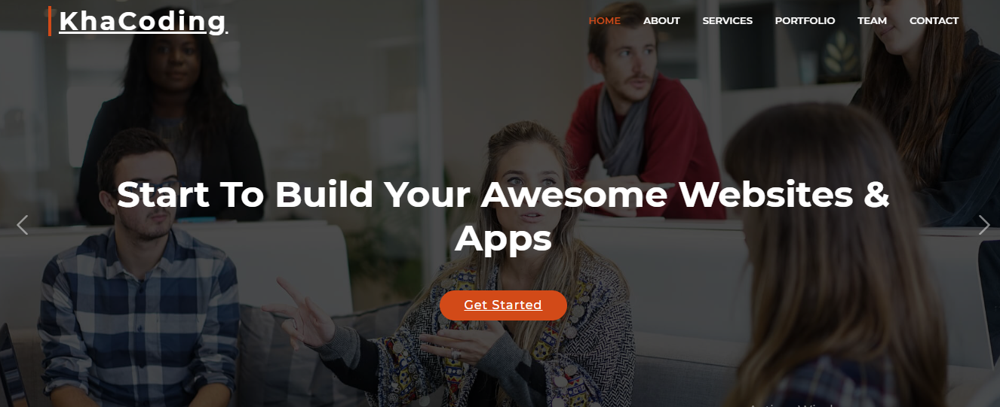

# Dev Box Project

Welcome to the Dev Box Project! This repository provides all the necessary tools and resources to digitalize your business efficiently and effectively.




## Table of Contents

- [Introduction](#introduction)
- [Features](#features)
- [Technologies Used](#technologies-used)
- [Getting Started](#getting-started)
- [Usage](#usage)

## Introduction

The Dev Box Project aims to streamline the process of digital transformation for businesses. Whether you are looking to automate processes, enhance your online presence, or implement new digital tools, our project offers a comprehensive suite of services designed to meet your needs.

## Features

- **Web Development**: Templates and frameworks to build robust websites and web applications.
- **Digital Marketing**: Resources for creating and managing digital marketing campaigns.
etc..

## Technologies Used

- **Frontend**: Angular for static websites, Angular, HTML, CSS, JavaScript
- **Database**: MySQL
- **Version Control**: Git, GitHub

### Getting Started

1. Clone the repository:


   git clone https://github.com/NaimiNour/MySoft.git
   cd MySoft
   ```

2. Install the necessary dependencies:

   npm install
   pip install -r requirements.txt

## Usage
Starting the Application
To start the application, run:


npm start

